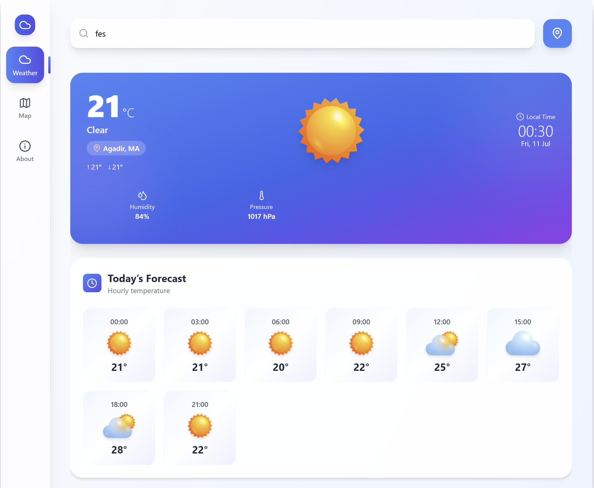
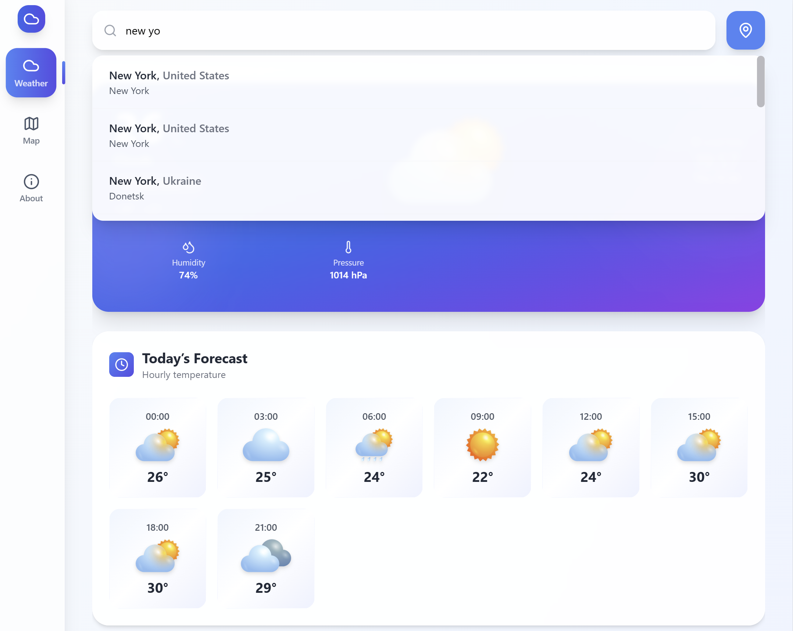
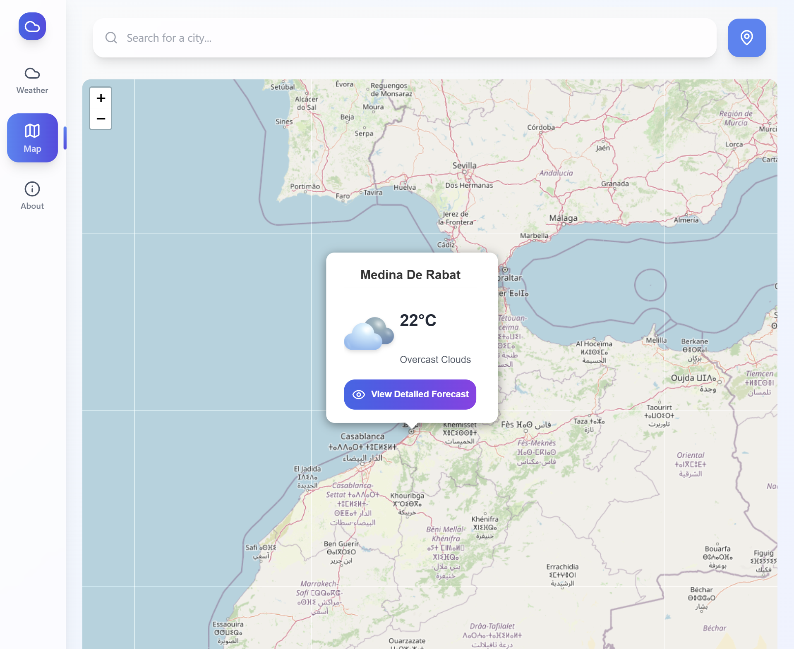

<div align="center">

# 🌤️ SkySync

*A lightweight, accurate & beautifully simple weather experience.*

[](#-technologies)
[](#-technologies)
[](#-technologies)
[](https://vercel.com/)
[](#-license)

</div>

---

## ✨ Features

|   |   |
|---|---|
| ⚡ **Real‑time data**  | Fresh weather every 10 minutes |
| 🎯 **Geo‑precise**     | GPS‑level targeting & interactive map |
| 📈 **7‑Day forecast**  | Hourly overview |
| 💎 **Modern UI**       | Glassmorphism, smooth animations, fully responsive |

---

## 📸 Screenshots


 
  
 
             
     


## 🔧 Technologies

- **React 18.3** – UI & routing
- **Tailwind CSS 3.x** – Utility‑first styling
- **Leaflet 1.9** – Interactive OpenStreetMap layer
- **OpenWeather API** – Current & forecasted weather
- **GeoNames** – Worldwide geocoding / city search
- **Vercel** & **GitHub Pages** – Zero‑config deployment

---

## 🚀 Quick Start

```bash
# 1 | Clone the repo
git clone https://github.com/kamalOurajdal/SkySync.git
cd SkySync

# 2 | Install dependencies
npm install
```

### 3 | Set Environment Variables

| Variable name                 | Description                    |
| ----------------------------- | ------------------------------ |
| `REACT_APP_OPEN_WEATHER_API_KEY`   | OpenWeather API key       |
| `REACT_APP_GEONAMES_USERNAME` | Username for GeoNames API      |

Create a `.env` file in the project root:

```bash
# .env
REACT_APP_OPEN_WEATHER_API_KEY=xxxxxxxxxxxxxxxxxxxxxxxxxxxxxxxx
REACT_APP_GEONAMES_USERNAME=your-geonames-username
```

```bash
# 4 | Run locally
npm start
```

<div align="center">

Crafted with ☕ and ❤️ by **Kamal Ourajdal**
[LinkedIn](https://www.linkedin.com/in/kamal-ourajdal)

</div>
